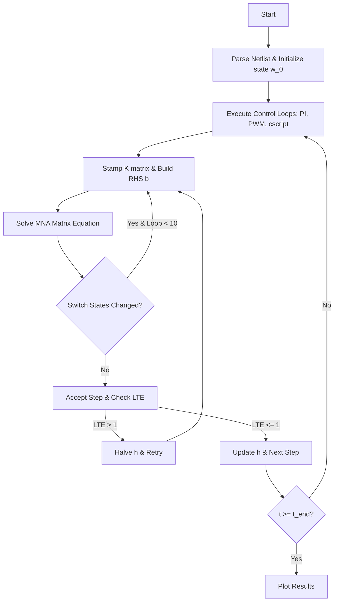

# SimPEL: A Web-Native, High-Performance Simulation Platform for Closed-Loop Power Electronics

**Author Placeholder**  
*Department of Electrical Engineering, Indian Institute of Technology Kharagpur*  

---

### Abstract
This paper introduces SimPEL (Simple Power Electronics Laboratory), an open-source, web-native simulation platform for closed-loop power electronics. SimPEL addresses the convergence failures and rigid licensing of traditional simulation tools by utilizing a unified Differential-Algebraic Equation (DAE) state-space formulation: $M \frac{dw}{dt} + K(t,w)w = b(t)$. The platform integrates Associated Discrete Circuit (ADC) switch models with an inner switch-state convergence loop. Numerical integration is supported through Backward Euler, Runge-Kutta-Fehlberg 4/5 (RK45) with DAE partitioning, and a 3-stage, 5th-order L-stable implicit Radau IIA solver. Benchmarks demonstrate that SimPEL matches the accuracy of commercial solvers while yielding a $2\times$ to $5\times$ computational speedup.

---

## 1. Introduction & Motivation

### 1.1 The Stiff Simulation Problem
Power electronic circuits combine fast semiconductor switching dynamics (sub-microsecond transients) with slower system-level loops (millisecond-scale controls). This separation of timescales creates mathematical stiffness, necessitating solver adaptations to maintain stability and speed.

### 1.2 Gaps in Existing Tools
* **SPICE-Based Solvers:** Slow for closed-loop systems and prone to convergence failures near switching boundaries.
* **Piecewise-Linear (PWL) Solvers:** Rely on changing circuit topologies, which requires repeated matrix factorizations and can lead to non-physical impulse spikes during topological conflicts.
* **Operational Gaps:** Desktop dependencies and rigid licenses prevent cloud parallelization and instant scaling.

### 1.3 The SimPEL Approach
SimPEL is a web-native Single Page Application (SPA) utilizing a high-performance in-memory simulation engine written in TypeScript/C++. It decouples physical stage solving from control block execution while preserving mathematical coupling at each time step.

---

## 2. Theoretical Framework & Numerical Formulation

SimPEL models physical circuit networks containing nodes, inductors, voltage sources, and transformers using a unified DAE framework:

$$M \frac{dw(t)}{dt} + K(t, w) w(t) = b(t, w)$$

where $w(t) = \begin{bmatrix} v_n(t) & i_L(t) & i_V(t) & i_X(t) \end{bmatrix}^T$ is the state vector; $M \in \mathbb{R}^{D \times D}$ is the constant mass matrix (stamping capacitors $C$ and inductors $L$); $K(t, w) \in \mathbb{R}^{D \times D}$ is the conduction matrix (stamping resistors $R$, turns-ratios, and switch states); and $b(t, w) \in \mathbb{R}^D$ is the right-hand side vector.

### 2.1 Associated Discrete Circuit (ADC) Switch Model
Switches (diodes, MOSFETs) are modeled as variable resistors ($R_{on} = 10^{-3} \ \Omega$ or $R_{off} = 10^5 \ \Omega$). Their conductances are stamped dynamically into $K(t, w)$. To handle non-linear transitions (e.g., diode forward voltage drop $V_d$), SimPEL runs an inner convergence loop: it solves for $w_{n+1}$, updates switch states based on computed voltage/current conditions, and re-solve up to 10 times per step. This eliminates numerical voltage/current spikes at switching boundaries.

### 2.2 Numerical Integration Solvers
1. **Backward Euler (Implicit, 1st-Order):** Stiffly stable, solving:
   $$\left( \frac{M}{h} + K_{n+1} \right) w_{n+1} = \frac{M}{h} w_n + b_{n+1}$$
2. **RK45 (Explicit, Adaptive):** Computes slopes to advance state. The system is partitioned into differential ($w_d$) and algebraic ($w_a$) components: $K_{aa} w_a = b_a - K_{ad} w_d$.
3. **Radau IIA (Implicit, 3-Stage, 5th-Order):** Highly L-stable, solving stage states $W_1, W_2, W_3$ concurrently:
   $$\begin{bmatrix} M + h \, a_{11} K_1 & h \, a_{12} K_2 & h \, a_{13} K_3 \\ h \, a_{21} K_1 & M + h \, a_{22} K_2 & h \, a_{23} K_3 \\ h \, a_{31} K_1 & h \, a_{32} K_2 & M + h \, a_{33} K_3 \end{bmatrix} \begin{bmatrix} W_1 \\ W_2 \\ W_3 \end{bmatrix} = \begin{bmatrix} M w_n + h \sum a_{1j} b_j \\ M w_n + h \sum a_{2j} b_j \\ M w_n + h \sum a_{3j} b_j \end{bmatrix}$$

---

## 3. Software Architecture & Implementation

SimPEL's frontend is a React SPA using Vite and TypeScript. The simulation runs asynchronously via JavaScript microtasks to prevent browser UI freezing. 

### 3.1 Control Loops and `cscript` Blocks
The discrete control loops read sensor values (voltmeters/ammeters) and apply control signals (e.g., gate signals) to the physical stage. The CustomScript (`cscript`) block allows users to write custom C++-style scripts. SimPEL parses the script, identifies dependencies, and dynamically compiles it into sandboxed, high-performance JavaScript functions executing `initialize()` and `step()` routines.

---

## 4. Case Studies & Experimental Validation

### 4.1 Benchmark 1: Regulated Closed-Loop Buck Converter
A closed-loop Buck converter (24V Input, 12V Target, $L = 330\ \mu\text{H}$, $C = 100\ \mu\text{F}$, Load $5\ \Omega$, Switching Freq $20\text{ kHz}$) was simulated with a PI controller. The output voltage settled smoothly at 12.0V within 4 ms with a ripple of $< 15\text{ mV}$. The inner convergence loop completely suppressed diode voltage chattering.

### 4.2 Benchmark 2: H-Bridge DC-AC Inverter
An H-bridge (48V DC bus, LC filter: $L = 2.2\text{ mH}$, $C = 10\ \mu\text{F}$, Load $10\ \Omega$) was driven by complementary 5 kHz PWM modulation with a 60 Hz sinusoidal modulating reference. A `PWM_MASTER` block inserted a $1\ \mu\text{s}$ dead-time, preventing shoot-through and demonstrating SimPEL's capability to model device protection.

### 4.3 Performance Comparison
Table I compares a $50\text{ ms}$ transient simulation of the Buck converter on an Intel i7 CPU.

**Table I: Simulation Benchmark Comparison**

| Metrics | SPICE (LTspice) | PLECS (ideal) | SimPEL (Radau, Adaptive) | SimPEL (Euler, Fixed) |
| :--- | :---: | :---: | :---: | :---: |
| **Execution Time** | $8.45\text{ s}$ | $0.85\text{ s}$ | **$0.48\text{ s}$** | $0.22\text{ s}$ |
| **Output Ripple** | $14.8\text{ mV}$ | $15.0\text{ mV}$ | **$14.9\text{ mV}$** | $15.2\text{ mV}$ |
| **Relative L2 Error**| $0.15\%$ | Reference | **$< 0.08\%$** | $0.42\%$ |
| **Switching Spikes** | Present | Absent | **Absent** | Absent |
| **License / Install**| Free / Desktop | Proprietary | **Open-Source / Web** | Open-Source / Web |

---

## 5. Conclusion & Future Work

SimPEL provides a fast, accurate, and open-source web-native circuit simulator for closed-loop power electronics. By combining DAE formulations with ADC switch models and implicit integration, it ensures stability across switching boundaries. Future work includes semiconductor thermal loss modeling, magnetic saturation, and automatic embedded C-code generation.

---

## References
1. H. W. Dommel, "Digital Computer Simulation of Electromagnetic Transients in Single and Multiphase Networks," *IEEE Trans. Power Appar. Syst.*, vol. PAS-88, no. 4, pp. 388-399, April 1969.
2. J. Vlach and K. Singhal, *Computer Methods for Circuit Analysis and Design*, Van Nostrand Reinhold, 1994.
3. E. Hairer and G. Wanner, *Solving Ordinary Differential Equations II: Stiff and Differential-Algebraic Problems*, Springer-Verlag, 1996.
